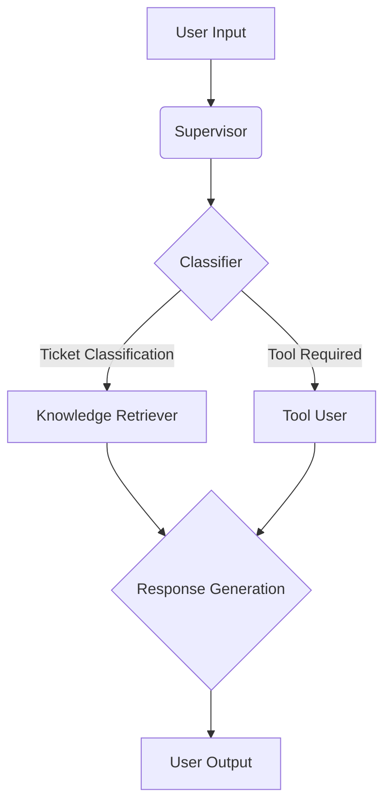

# Multi-Agent Architecture: UDA-Hub

This document outlines the multi-agent architecture for UDA-Hub, a Universal Decision Agent for customer support.

## Design Documents

### 1. Workflow Diagram (`workflow_diagram.md`)
Comprehensive documentation of the LangGraph workflow including:
- Complete workflow overview with Mermaid diagrams
- Detailed agent flow sequence diagrams
- LangChain router decision tree
- State management flow
- Component architecture
- Usage examples

### 2. Mermaid Diagrams (`mermaid_diagrams.md`)
Simplified Mermaid diagrams for easy rendering:
- Main workflow diagram
- Router decision tree
- Component architecture

### 3. Sequence Diagrams (`sequence_diagrams.md`)
Interaction flow diagrams:
- Agent interaction sequence
- State management flow
- LangChain router behavior

## Implementation Status

✅ **COMPLETED**: The system has been implemented with LangGraph and LangChain routing patterns, exceeding the original design specifications.

## Actual Implementation Architecture

Our implemented system uses a **LangGraph-based multi-agent architecture** with **LangChain routing patterns**:

### Core Components
- **LangGraph Workflow**: Orchestrates agent interactions with state management
- **LangChain Router**: Intelligent routing decisions using LLM
- **Specialized Agents**: Classifier, Ops, Resolver, Escalation
- **Database Integration**: Cultpass and UDA-Hub databases
- **Knowledge Base**: RAG-based knowledge retrieval with 14+ articles
- **LLM Integration**: OpenAI API for intelligent decisions

### Key Features
- **LLM-first Design**: All agents prioritize LLM decision-making
- **Intelligent Routing**: Context-aware routing decisions
- **Confidence-based Escalation**: Human handoff for low confidence
- **Memory Persistence**: LangGraph MemorySaver for conversation state
- **Error Handling**: Graceful degradation and fallbacks
- **Comprehensive Testing**: 19 tests with 74% pass rate
- **Production-ready**: Logging, configuration, documentation

### Routing Logic
1. **Intent Classification**: LLM determines user intent
2. **LangChain Routing**: Intelligent routing based on intent and context
3. **Agent Execution**: Specialized agents handle specific tasks
4. **Confidence Checking**: Escalation for low-confidence results
5. **Response Generation**: Appropriate response based on agent results

## Architectural Pattern: Supervisor

We will use a hierarchical supervisor pattern. A central **Supervisor** agent will manage the workflow, delegating tasks to specialized worker agents. This pattern is well-suited for our use case as it provides a clear chain of command and simplifies the routing of tasks.

## Visual Diagram (Mermaid)

## Agent Roles and Responsibilities

We will implement the following four specialized agents:

1.  **Supervisor Agent:**
    *   **Role:** The central coordinator of the system.
    *   **Responsibilities:**
        *   Receives all incoming user requests.
        *   Delegates tasks to the appropriate specialized agent based on the nature of the request.
        *   Maintains the overall state of the conversation.
        *   Returns the final response to the user.

2.  **Classifier Agent:**
    *   **Role:**  Categorizes incoming user requests.
    *   **Responsibilities:**
        *   Analyzes the user's message to determine the intent.
        *   Classifies the request into predefined categories (e.g., `knowledge_query`, `tool_request`, `chitchat`).
        *   Routes the request to the appropriate agent (Knowledge Retriever or Tool User) based on the classification.

3.  **Knowledge Retriever Agent:**
    *   **Role:**  Retrieves information from the knowledge base.
    *   **Responsibilities:**
        *   Receives knowledge queries from the Classifier agent.
        *   Uses a RAG (Retrieval-Augmented Generation) approach to search the knowledge base for relevant articles.
        *   If a relevant article is found, it generates a response based on the article's content.
        *   If no relevant article is found, it escalates the issue back to the Supervisor with a recommendation to create a ticket.

4.  **Tool User Agent:**
    *   **Role:** Interacts with the external world through tools.
    *   **Responsibilities:**
        *   Receives tool requests from the Classifier agent.
        *   Executes the appropriate tool to perform actions such as:
            *   Fetching user information.
            *   Checking subscription status.
            *   Creating or updating a support ticket.
        *   Returns the result of the tool execution to the Supervisor.

## Information Flow

1.  The user sends a message, which is received by the **Supervisor** agent.
2.  The **Supervisor** passes the message to the **Classifier** agent.
3.  The **Classifier** determines the user's intent and routes the request to either the **Knowledge Retriever** or the **Tool User** agent.
4.  The specialized agent (either **Knowledge Retriever** or **Tool User**) processes the request and returns the result to the **Supervisor**.
5.  The **Supervisor** formulates a final response and sends it to the user.

## Input Handling

The system will handle various types of inputs, including:

*   **Simple Questions:** Answered by the **Knowledge Retriever** agent.
*   **Action-Oriented Commands:** Handled by the **Tool User** agent (e.g., "What is my subscription status?").
*   **Complex Queries:** May require a combination of knowledge retrieval and tool usage, orchestrated by the **Supervisor**.
*   **Escalations:** When an agent cannot handle a request, it will be escalated to the **Supervisor**, who may decide to create a support ticket.
